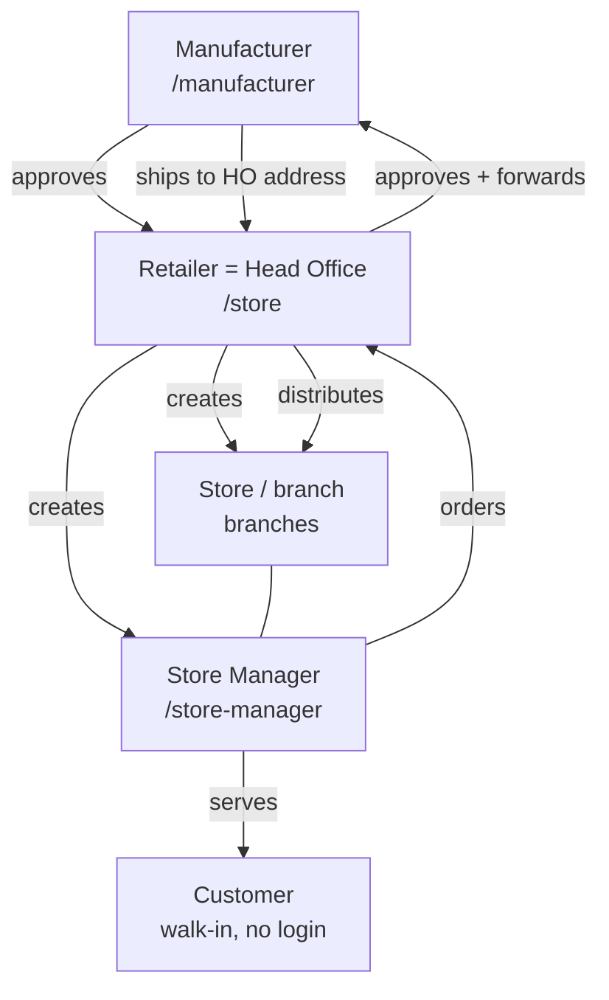

# Jewel Factory — Complete System Flow

Plain-language walkthrough of the WHOLE system: who the actors are, who creates
whom, how the public site works, how an order travels, approvals, shipping, chat,
search/filters, and the rules that never break. UI names vs code names are noted.

> **One line:** Jewel Factory is a **B2B gold-jewellery platform** connecting one
> **Manufacturer** to its **Retailer** network and their in-store **Customers** —
> **no price is shown anywhere**, and **customer personal data never reaches the
> manufacturer**.

Related docs: [USER_MANUAL.md](USER_MANUAL.md) (non-technical staff guide) ·
[DATABASE.md](DATABASE.md) (schema) · [HANDOVER.md](HANDOVER.md) (fresh setup) ·
[SETUP_GUIDE.md](SETUP_GUIDE.md) (dev) · [DEPLOY_RENDER.md](DEPLOY_RENDER.md) ·
[AWS_MIGRATION.md](AWS_MIGRATION.md) · [PENDING.md](PENDING.md) ·
[../CLAUDE.md](../CLAUDE.md) (technical detail).

---

## 1. The three (+1) actors

| Actor | Code name | Portal | Does |
|---|---|---|---|
| **Manufacturer** | (global admin) | `/manufacturer/*` | Owns the design catalog (gold only, no price, auto `JF-XXXX`); approves retailers; receives + fulfils orders; ships to the retailer's fixed address. **Never sees customer data.** |
| **Retailer** = **Head Office** | `stores` table | `/store/*` | Self-registers → manufacturer approves. Creates Stores (branches) + Store Managers. **Does ALL approvals** for every branch (kiosk/B2B/custom), edits the requirement note, chats with Store Managers, restocks from the catalog. Has ONE fixed Head-Office address. |
| **Store** (branch) | `branches` table | — | One physical shop of the retailer. A retailer has MANY. Created by the Retailer. Has its own fixed address + restock PIN + store managers. |
| **Store Manager** | `branch_managers` table | `/store-manager/*` | Runs ONE branch. Serves walk-in customers on the kiosk; places kiosk/custom/restock orders (which go to the Retailer for approval). |
| **Customer** (walk-in) | — (not stored) | — | Comes to a store; the Store Manager helps on the kiosk. **No login, no personal data stored.** |

> **Terminology trap:** in the code, `stores` = **Retailer**, `branches` =
> **Store**, `branch_managers` = **Store Manager**. The old separate "HO Manager"
> role (`store_managers` table / `/store/manager/login`) has been **removed** — the
> Retailer IS the Head Office now. The `store_managers` table is kept only for
> historical approver references and is otherwise inert.



---

## 2. The public site (logged-out)

Visiting `/` (or `/portal`, `/about`) with no session shows the **branded landing**:

- **Navbar:** logo · Catalog · About · **Login** · **Register here**.
- **Hero:** "Welcome to Jewel Factory" + call-to-action.
- **Featured showcase:** a few REAL catalog pieces (public `GET /api/kiosk/catalog`,
  no price) with a "Register to see the full catalog" CTA. The full catalog is
  visible only after login.
- **Why Jewel Factory:** feature cards (gold-only, AR try-on, **similar-design
  search**, customer privacy, multi-store).
- **Login popup** (from the Login button): two columns — **Retailer** and **Store
  Manager** — each with an embedded login form; the Retailer column links to
  "Register here". Manufacturer is intentionally NOT here.
- **Register prompt:** ~5 s after load a "Become a Retailer" popup appears once per
  session (dismissible), nudging new retailers to `/store/register`.
- **`/about`:** roles, order flow, and the platform's principles.
- **`/manufacturer`:** the manufacturer sign-in entry — opening this URL shows the
  manufacturer login page (or redirects to the dashboard if already signed in).
  It is available from the public footer's **Manufacturer access** link.

### Shared portal-entry layout

The full-page Retailer, Store Manager, and Manufacturer sign-in screens, plus
Retailer registration, use `components/auth/PortalLoginScreen.tsx`. On tablet and
desktop it renders a contained two-panel card; on mobile it becomes a single
content panel. Sign-in forms remain vertically centred. Registration is the one
long-form variant: its right panel scrolls internally so fields never extend past
the rounded outer card or make the marketing panel drift while scrolling.

Authentication fields are supplied by the shared `StaffLoginForm`. Full-page
forms show visible labels; the compact public-site login modal keeps its denser
layout. The `/manufacturer` entry checks the manufacturer session on the server,
so a signed-out visit does not generate avoidable `/api/manufacturer/me` 401
errors in the browser console.

---

## 3. Who creates whom

```
Manufacturer  --approves-->  Retailer (registration)     [Retailer = Head Office]
Retailer      --creates-->   Stores (branches)           [/store/branches]
Retailer      --creates-->   Store Managers (per branch) [/store/branches → expand]
```

Stores + managers are NOT hardcoded — created via the portal (or the demo seed).

---

## 4. The Store Manager's device (Kiosk vs Restock)

The Store Manager logs in on a device (phone / tablet / PC):

- **Kiosk** (`/store-manager/kiosk`) — browse catalog + place a customer order.
- **Try-On** (`/store-manager/try-on`) — AR overlay of a piece on the customer.
- **Search** (`/store-manager/search`) — **similar-design search**: upload a photo,
  get visually-matching catalog designs. The Store Manager route and public
  storefront search provide separate **Take photo** and **Choose photo** actions.
  **Take photo** requests the rear camera on mobile; **Choose photo** opens the
  device's normal image picker so an existing gallery image can be used.
- **Custom Design** (`/store-manager/custom-design`) — capture a custom requirement
  (specs + note + reference image).
- **Restock** (`/store-manager/restock`) — order stock for THIS store.
  **PIN-protected** (per-branch restock PIN) so a customer holding the device can't
  open it.

Kiosk/custom carry **no customer PII** — only products + quantity + an editable
**requirement note** — so the device is safe to hand to the customer.

---

## 5. Order flows

All three flows end at the manufacturer, **via the Retailer (Head Office) approval
gate**.

### (a) Kiosk customer order
```
Store Manager (kiosk) → order (products + qty + requirement note)
  → Retailer (Head Office) sees "Store X raised this", can EDIT the note, APPROVES
  → Manufacturer receives it (note + branch shown; NO customer data)
  → Manufacturer ships to the Retailer HO address
  → Retailer distributes to the branch that raised it
```

### (b) Restock (B2B) order
```
Store Manager (restock, after PIN) → order from the manufacturer catalog
  → Retailer (Head Office) approves (can edit note)
  → Manufacturer → ships to Retailer HO address
  → on DELIVERED, stock materializes into the retailer's Product table
```

### (c) Custom design
```
Store Manager (custom-design) → requirement (specs + note + reference image)
  → Retailer (Head Office) approves / forwards
  → Manufacturer receives a SANITIZED custom-design order (no customer data), CD-xxxx
  → ships to Retailer HO address
```

**The requirement note:** written by the Store Manager, editable by the Store
Manager AND the Retailer, travels all the way to the manufacturer. Contains the
customer's ASK (size, engraving, timeline) — **never personal data**.

---

## 6. After sending — My Orders, status, chat

A Store Manager tracks sent orders on `/store-manager/my-orders` (Kiosk / Custom /
Restock tabs). Status buckets shown to the Store Manager:

- **Pending (Head Office)** — waiting for Retailer approval
- **Approved by Head Office** — approved, on its way to / with the manufacturer
- **Rejected**
- **Completed** — the Store Manager marks this when the piece reaches the customer
  (a flag, not an approval state)

The Store Manager sees only these buckets — **NOT** the manufacturer's granular
status. The full manufacturer status (CD-xxxx + confirmed/shipped/tracking) is
**Head-Office-only**, on the Retailer's Custom Designs page.

**Per-order chat (Head Office ↔ Store Manager):**
- Every order has a "Message" thread; both sides can send.
- Store Manager: "Message Head Office" on My Orders.
- Retailer: "Message" on Pending Approvals AND on Custom Designs.
- Messages stay between Head Office and the Store Manager (no customer, no
  manufacturer). Stored in `order_messages`, scoped to the retailer.

**Search + filters (every order list — client-side):**
- **Store Manager** My Orders: search by order ID; filter by status bucket; From/To date.
- **Retailer / Head Office** (Kiosk / Custom / Restock): search by order ID; filter by
  status; filter by **Store (branch)** — each row shows a branch badge; From/To date.
- **Manufacturer** (Kiosk / Custom / B2B Orders): search by order ID; filter by
  status; filter by **Retailer**; From/To date.
- Date range filters on the order's created date (inclusive).
- Retailer order detail shows which **Branch** it came from; Manufacturer order
  detail shows which **Retailer** it came from.

---

## 7. Manufacturer "Add Design" + Generate with AI (optional)

Manufacturer adds designs at `/manufacturer/catalog` → New. **Manual flow (always):**
pick Category / Sub-category / Weight / Purity → enter Design Name → upload catalog
photo(s) → optional try-on PNG → Save. Design number `JF-XXXX` is auto; no price,
gold only. New designs default to **Active** (visible).

**Generate with AI (shown only if `AI_FEATURES_URL` is configured):**
1. Upload a RAW product photo (phone photo — temporary, NOT saved), pick specs.
2. "Generate with AI" calls the AI-Features service and fills: Design Name +
   Description, an attractive luxury catalog image, and a transparent try-on PNG.
3. Everything is editable; you can regenerate any output, optionally with a custom
   instruction. Generated catalog/try-on images are click-to-zoom.
4. Review and Save.

AI is OPTIONAL — if not configured, the button is hidden and manual add works the
same. All AI lives in ONE service (see §11); requests are proxied server-side
(`/api/manufacturer/ai/*`) so the AI key never hits the browser.

---

## 8. Shipping & addresses

- Manufacturer knows only the **Retailer's fixed Head-Office address** → ships there.
- Retailer knows every branch's fixed address → distributes internally.
- Every order carries the branch name (`branchNameSnapshot`) so the Retailer and
  the manufacturer can see which store it is for.

---

## 9. Logins (3) + cookies

| Role | Login page | Cookie | Payload |
|---|---|---|---|
| Manufacturer | `/manufacturer/login` (or `/manufacturer`) | `jf_manufacturer` | manufacturerId |
| Retailer (Head Office) | `/store/login` | `jf_store` | storeId (= retailerId) |
| Store Manager | `/store-manager/login` | `jf_branch_manager` | bmId.branchId.retailerId |

The old "HO Manager" login (`/store/manager/login` + `jf_manager`) is **removed**.

**PIN cookies** (device unlock, not logins): `jf_kiosk` (legacy per-store kiosk),
`jf_restock` (per-branch restock unlock).

**Secrets** (`lib/env.ts`): `MANUFACTURER_SECRET`, `STORE_SECRET`, `MANAGER_SECRET`,
`BRANCH_MANAGER_SECRET` (optional; falls back to `MANAGER_SECRET`).

**Demo credentials** (after `pnpm db:seed`): Manufacturer `admin@atjewellers.com` /
the password set with `SEED_MANUFACTURER_PASSWORD`; Retailer (demo mode) `store@demo.com` / `store123`. Store Managers
are created by the Retailer — no default account.

---

## 10. Privacy rule (never break)

Customer personal data (name / phone / email / address) is **NOT stored** and
**NEVER** reaches the manufacturer. Kiosk + custom orders carry only products,
quantity, and the requirement note. The manufacturer sees: retailer name, branch
name, requirement note, and the retailer's HO ship-to address — nothing personal.

Related: **no price** anywhere (gold-only business); the store quotes the customer
directly.

---

## 11. Key DB tables

See [DATABASE.md](DATABASE.md) for the full schema.

| Table | Role / purpose |
|---|---|
| `stores` | **Retailer** (= Head Office) + fixed HO address (`kioskPinHash` legacy) |
| `store_managers` | **legacy/inert** (was "HO Manager"; role removed) — kept only for historical approver references |
| `branches` | **Store** + fixed address + `restock_pin_hash` |
| `branch_managers` | **Store Manager** |
| `manufacturer_products` | catalog design (gold only, no price, `JF-XXXX`, `has_tryon`) |
| `kiosk_orders` | guest orders + `branch_id`, `branch_name_snapshot`, `requirement_note`, `completed_at`; the current kiosk flow does **not** collect or populate customer PII |
| `b2b_orders` | restock + `branch_id`, `branch_name_snapshot`, `requirement_note`, `completed_at` |
| `custom_design_requests` | + `branch_id`, `completed_at`; the current kiosk flow does **not** collect or populate customer PII |
| `custom_design_orders` | sanitized order forwarded to the manufacturer |
| `order_messages` | per-order chat (Head Office ↔ Store Manager); polymorphic (`order_kind` + `order_id`) |

---

## 12. AI services (one Python service, separate deploy)

All AI runs in ONE separate service: **AI-Features**
(repo `github.com/teamai-botivate/Jewel-Factory_AI`, deployed as a Hugging Face
Docker Space; `AI_FEATURES_URL` in Jewel Factory env).

| Endpoint | Input → Output |
|---|---|
| `/catalog` | raw photo → attractive studio catalog image |
| `/transparent` | raw photo + type → background-free try-on PNG (front-only) |
| `/describe` | image + specs → designName + description |
| `/embed/*` | image/text → OpenCLIP vectors (**visual / similar-design search**) |

The old embedder is merged here — `EMBEDDER_URL` points at the SAME Space; the
`/embed/image` contract is unchanged. One URL for everything AI; a future AI feature
is a new endpoint in the same service, no new deployment. Needs `OPENAI_API_KEY` on
the service. (The OpenAI-backed endpoints return `429 insufficient_quota` if the
OpenAI account has no credit; `/embed/*` uses local OpenCLIP and is unaffected.)

---

## 13. Migrating an existing deployment (keep old data)

1. `pnpm db:deploy` — applies all Prisma migrations (idempotent).
2. `pnpm migrate:branches` — for every retailer, create a default "Main Store"
   branch and link old kiosk/B2B/custom records to it. Safe to re-run.
3. Create real branches + store managers via `/store/branches`.

**Fresh DB (new client):** just `pnpm db:deploy` + `pnpm db:seed` — nothing manual.
Full client setup: [HANDOVER.md](HANDOVER.md).
